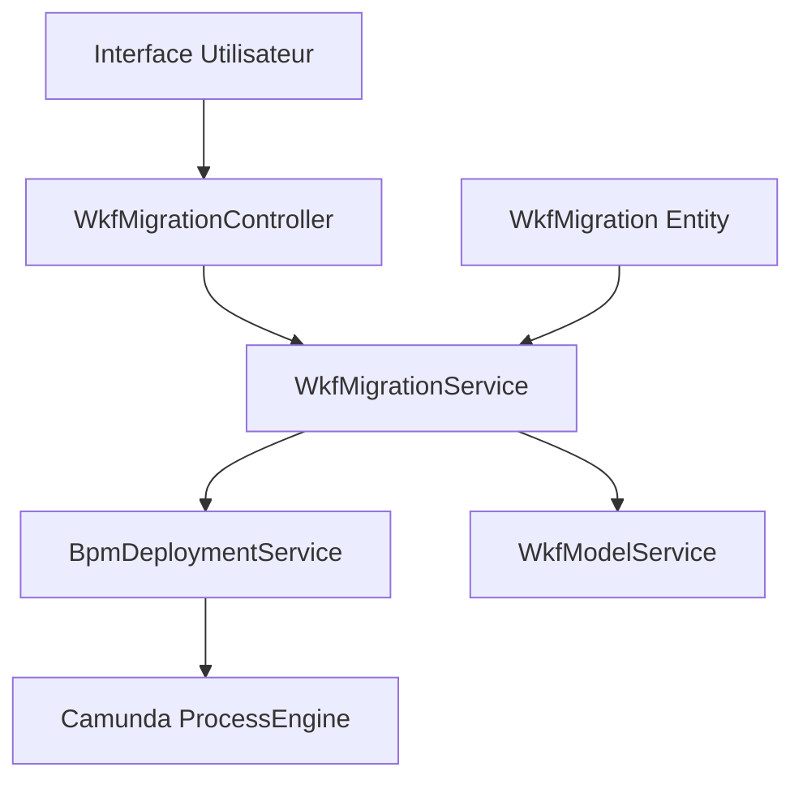

# Documentation Technique - Migration BPM Engine Axelor Studio

## Table des Matières

1. [Vue d'ensemble](#vue-densemble)
2. [Architecture du Système de Migration](#architecture-du-système-de-migration)
3. [Modèle de Données](#modèle-de-données)
4. [Logique de Migration](#logique-de-migration)
5. [Analyse Comparative avec Camunda 7](#analyse-comparative-avec-camunda-7)
6. [Bonnes Pratiques et Recommandations](#bonnes-pratiques-et-recommandations)
7. [Limitations et Points d'Amélioration](#limitations-et-points-damélioration)

## Vue d'ensemble

Le système de migration BPM d'Axelor Studio est basé sur Camunda 7.17.0 et fournit des fonctionnalités de migration d'instances de processus entre différentes versions de modèles de workflow. Cette fonctionnalité est essentielle pour maintenir la continuité des processus métier lors des évolutions des modèles BPMN.

### Composants Principaux

- **WkfMigrationService** : Service principal de gestion des migrations
- **WkfMigrationController** : Contrôleur web pour l'interface utilisateur
- **BpmDeploymentService** : Service de déploiement avec capacités de migration
- **WkfMigration** : Entité de données pour stocker les configurations de migration

## Architecture du Système de Migration

### Structure des Services



### Flux de Migration

1. **Préparation** : Analyse des modèles source et cible
2. **Génération de Plan** : Création du mapping des nœuds
3. **Validation** : Vérification des instructions de migration
4. **Exécution** : Application de la migration via Camunda API
5. **Suivi** : Enregistrement des résultats et gestion des erreurs

## Modèle de Données

### Entité WkfMigration

```xml
<entity name="WkfMigration" cacheable="true">
  <many-to-one name="sourceVersion" ref="com.axelor.studio.db.WkfModel" 
    title="Source version"/>
  <many-to-one name="targetVersion" ref="com.axelor.studio.db.WkfModel" 
    title="Target version"/>
  <string name="mapping" title="Mapping" large="true"/>
  <boolean name="upgradeAllInstances" 
    title="migrate all the instances of previous version"/>
  <boolean name="removeOldVersionMenu" title="Remove old version menu" 
    default="false"/>
  <integer name="totalInstancesToMigrate" title="Total instances to migrate"/>
  <integer name="successfulMigrations" title="Successful migrations"/>
  <integer name="failedMigrations" title="Failed migrations"/>
</entity>
```

### Propriétés Clés

- **sourceVersion/targetVersion** : Références vers les modèles source et cible
- **mapping** : Configuration JSON du mapping des nœuds
- **upgradeAllInstances** : Flag pour migration automatique vers la dernière version
- **Métriques de migration** : Compteurs de succès et d'échecs

## Logique de Migration

### 1. Génération du Plan de Migration

#### Service WkfMigrationService.generateNodeMap()

```java
public Map<String, Object> generateNodeMap(WkfMigration migration) {
    WkfModel sourceVersion = migration.getSourceVersion();
    WkfModel targetVersion = migration.getTargetVersion();
    
    // Analyse des modèles BPMN
    BpmnModelInstance sourceBpmInstance = 
        Bpmn.readModelFromStream(new ByteArrayInputStream(
            sourceVersion.getDiagramXml().getBytes()));
    BpmnModelInstance targetBpmInstance = 
        Bpmn.readModelFromStream(new ByteArrayInputStream(
            targetVersion.getDiagramXml().getBytes()));
    
    // Génération du mapping des nœuds
    Map<String, Object> _map = new HashMap<>();
    List<Map<String, Object>> _mapList = new ArrayList<>();
    
    for (Process process : processList) {
        // Pour chaque processus, analyser les nœuds
        Collection<FlowNode> flowNodes = process.getChildElementsByType(FlowNode.class);
        Process targetProcess = targetBpmInstance.getModelElementById(process.getId());
        
        for (FlowNode node : flowNodes) {
            // Rechercher les nœuds compatibles dans le modèle cible
            List<Map<String, Object>> optionMapList = getTargetNodes(targetProcess, node);
            // ...
        }
    }
    return _map;
}
```

#### Logique de Mapping des Nœuds

La méthode `getTargetNodes()` utilise une logique de compatibilité par type :

```java
private String getType(FlowNode node) {
    String type = node.getElementType().getTypeName().toLowerCase();
    
    if (type.contains("task")) {
        return "task";
    } else if (type.contains("event")) {
        return "event";
    } else if (type.contains("gateway")) {
        return "gateway";
    } else if (type.contains("subprocess")) {
        return "subprocess";
    } else {
        return type;
    }
}
```

**Analyse** : Cette approche simplifie le mapping en regroupant les éléments par catégorie plutôt que par type exact, ce qui peut être à la fois un avantage (flexibilité) et un inconvénient (précision).

### 2. Exécution de la Migration

#### BpmDeploymentService.migrateRunningInstances()

```java
protected void migrateRunningInstances(
    String oldDeploymentId,
    ProcessEngine engine,
    List<ProcessDefinition> definitions,
    Map<String, WkfProcess> migrationProcessMap,
    boolean upgradeToLatest) {
    
    final AtomicBoolean isMigrationError = new AtomicBoolean(false);
    
    // Migration automatique vers la dernière version
    if (upgradeToLatest) {
        migrateInstancesToLatest(sortedDefinitions, engine, isMigrationError);
    }
    
    // Migration avec plan personnalisé
    oldDefinitions.forEach(oldDefinition ->
        definitions.stream()
            .filter(newDefinition -> oldDefinition.getKey().equals(newDefinition.getKey()))
            .forEach(newDefinition -> {
                MigrationPlan plan = createMigrationPlan(engine, oldDefinition, newDefinition);
                if (plan != null) {
                    computeMigrationInstances(engine, oldDefinition, newDefinition, 
                        plan, migrationProcessMap, isMigrationError);
                }
            }));
}
```

#### Création du Plan de Migration Camunda

```java
protected MigrationPlan createMigrationPlan(
    ProcessEngine engine, 
    ProcessDefinition oldDefinition, 
    ProcessDefinition newDefinition) {
    
    Map<String, String> processMap = 
        (Map<String, String>) migrationMap.get(newDefinition.getKey());
    
    if (processMap == null) {
        return null;
    }
    
    MigrationPlanBuilder planBuilder = engine
        .getRuntimeService()
        .createMigrationPlan(oldDefinition.getId(), newDefinition.getId());
    
    // Application des mappings définis par l'utilisateur
    processMap.keySet().forEach(key -> {
        // Vérification de l'existence d'instances actives
        long count = engine.getHistoryService()
            .createHistoricActivityInstanceQuery()
            .processDefinitionId(oldDefinition.getId())
            .activityId(key)
            .unfinished()
            .count();
        
        if (count == 0) {
            return;
        }
        
        String value = processMap.get(key);
        if (value != null) {
            // Gestion spéciale pour les événements intermédiaires
            if (instance.getElementType().getTypeName()
                .equals(BpmnModelConstants.BPMN_ELEMENT_INTERMEDIATE_CATCH_EVENT)) {
                planBuilder.mapActivities(key, value).updateEventTrigger();
            } else {
                planBuilder.mapActivities(key, value);
            }
        }
        
        // Gestion des activités multi-instances
        Collection<MultiInstanceLoopCharacteristics> childInstaces =
            instance.getChildElementsByType(MultiInstanceLoopCharacteristics.class);
        if (childInstaces != null && !childInstaces.isEmpty()) {
            planBuilder.mapActivities(key + "#multiInstanceBody", 
                value + "#multiInstanceBody");
        }
    });
    
    return planBuilder.build();
}
```

### 3. Gestion des Erreurs et Suivi

```java
private AtomicBoolean computeMigrationInstances(
    ProcessEngine engine,
    ProcessDefinition oldDefinition,
    ProcessDefinition newDefinition,
    MigrationPlan plan,
    Map<String, WkfProcess> migrationProcessMap,
    AtomicBoolean isMigrationError) {
    
    int migratedInstances = 0;
    int unmigratedInstances = 0;
    
    for (String processInstanceId : processInstanceIds) {
        try {
            // Sauvegarde des tâches actives avant migration
            ArrayList<Task> activeTasks = (ArrayList<Task>) getActiveTasks(engine, processInstanceId);
            
            // Exécution de la migration
            engine.getRuntimeService()
                .newMigration(plan)
                .processInstanceIds(processInstanceId)
                .execute();
            
            // Mise à jour des statuts des tâches
            updateTasksStatus(activeTasks, processInstanceId);
            wkfInstanceService.updateProcessInstance(
                targetProcess, processInstanceId, WkfInstanceRepository.STATUS_MIGRATED_SUCCESSFULLY);
            migratedInstances++;
            
        } catch (Exception e) {
            isMigrationError.set(true);
            wkfInstanceService.updateProcessInstance(
                null, processInstanceId, WkfInstanceRepository.STATUS_MIGRATION_ERROR);
            unmigratedInstances++;
        }
        
        // Mise à jour de la barre de progression WebSocket
        if (isWebSocketSupported) {
            BpmDeploymentWebSocket.updateProgress(
                sessionId, calculatePercentage(iterationNumber, processInstanceIds.size()));
        }
    }
    
    // Enregistrement des statistiques
    migrationMap.put("successfulMigrations", migratedInstances);
    migrationMap.put("failedMigrations", unmigratedInstances);
    
    return isMigrationError;
}
```

## Analyse Comparative avec Camunda 7

### Points Forts de l'Implémentation Axelor Studio

#### 1. **Interface Utilisateur Intuitive**

**Axelor Studio** :
```xml
<custom name="wkf-migration-mapping-custom" title="Node mapping">
  <template>
    <![CDATA[
      <Table>
        <TableRow>
          <TableCell><b>Source node</b></TableCell>
          <TableCell><b>Target node</b></TableCell>
        </TableRow>
        {value?.nodes?.map((node) => (
          <TableRow key={node.nodeId}>
            <TableCell>{node.nodeName}</TableCell>
            <TableCell>
              <Box as="select">
                {node?.options?.map((option) => (
                  <option value={option.nodeId}>{option.nodeName}</option>
                ))}
              </Box>
            </TableCell>
          </TableRow>
        ))}
      </Table>
    ]]>
  </template>
</custom>
```

**Avantages** :
- Interface graphique pour le mapping des nœuds
- Visualisation claire des options de migration
- Validation interactive des mappings

**Camunda 7 Standard** :
```java
// Approche programmatique uniquement
MigrationPlan migrationPlan = processEngine.getRuntimeService()
    .createMigrationPlan("sourceProcessId", "targetProcessId")
    .mapActivities("sourceActivity", "targetActivity")
    .build();
```

#### 2. **Gestion des Versions Hiérarchiques**

**Axelor Studio** utilise une requête SQL récursive pour identifier les versions cibles :

```java
public List<Long> getTargetVersionIds(WkfModel sourceVersion) {
    return JPA.em()
        .createNativeQuery(
            "WITH RECURSIVE wm AS " +
            "(SELECT id, name, previous_version FROM studio_wkf_model WHERE id = :sourceVersionId " +
            "UNION ALL " +
            "SELECT m.id, m.name, m.previous_version FROM studio_wkf_model m " +
            "JOIN wm s ON s.id = m.previous_version) " +
            "SELECT id FROM wm WHERE id != :sourceVersionId")
        .setParameter("sourceVersionId", sourceVersion.getId())
        .getResultList();
}
```

**Avantages** :
- Gestion automatique de l'arbre des versions
- Possibilité de migration entre versions non-consécutives
- Traçabilité complète de l'historique des versions

#### 3. **Monitoring et Feedback en Temps Réel**

```java
// Barre de progression WebSocket
if (isWebSocketSupported) {
    BpmDeploymentWebSocket.updateProgress(
        sessionId, calculatePercentage(iterationNumber, processInstanceIds.size()));
}
```

**Avantages** :
- Suivi en temps réel du progrès de migration
- Interface utilisateur réactive
- Meilleure expérience utilisateur pour les migrations longues

### Conformité aux Bonnes Pratiques Camunda 7

#### 1. **✅ Utilisation Correcte des APIs Camunda**

L'implémentation utilise correctement les APIs de migration de Camunda :

```java
// Création du plan de migration
MigrationPlanBuilder planBuilder = engine
    .getRuntimeService()
    .createMigrationPlan(oldDefinition.getId(), newDefinition.getId());

// Gestion des événements avec updateEventTrigger()
if (instance.getElementType().getTypeName()
    .equals(BpmnModelConstants.BPMN_ELEMENT_INTERMEDIATE_CATCH_EVENT)) {
    planBuilder.mapActivities(key, value).updateEventTrigger();
}

// Exécution de la migration
engine.getRuntimeService()
    .newMigration(plan)
    .processInstanceIds(processInstanceId)
    .execute();
```

#### 2. **✅ Gestion des Multi-Instances**

```java
// Traitement des activités multi-instances
Collection<MultiInstanceLoopCharacteristics> childInstaces =
    instance.getChildElementsByType(MultiInstanceLoopCharacteristics.class);
if (childInstaces != null && !childInstaces.isEmpty()) {
    planBuilder.mapActivities(key + "#multiInstanceBody", 
        value + "#multiInstanceBody");
}
```

#### 3. **✅ Préservation de l'État des Tâches**

```java
// Sauvegarde et restauration des tâches actives
ArrayList<Task> activeTasks = (ArrayList<Task>) getActiveTasks(engine, processInstanceId);
// ... migration ...
updateTasksStatus(activeTasks, processInstanceId);
```

#### 4. **✅ Gestion des Erreurs par Instance**

```java
for (String processInstanceId : processInstanceIds) {
    try {
        // Migration d'une instance
        engine.getRuntimeService()
            .newMigration(plan)
            .processInstanceIds(processInstanceId)
            .execute();
        migratedInstances++;
    } catch (Exception e) {
        // Gestion d'erreur individuelle sans affecter les autres
        isMigrationError.set(true);
        wkfInstanceService.updateProcessInstance(
            null, processInstanceId, WkfInstanceRepository.STATUS_MIGRATION_ERROR);
        unmigratedInstances++;
    }
}
```

### Points d'Amélioration par Rapport aux Bonnes Pratiques

#### 1. **⚠️ Absence de Migration Asynchrone**

**Problème** : Toutes les migrations sont exécutées de manière synchrone.

**Bonne Pratique Camunda** :
```java
// Migration asynchrone pour de gros volumes
Batch batch = runtimeService.newMigration(migrationPlan)
    .processInstanceIds(processInstanceIds)
    .executeAsync();
```

**Recommandation** : Implémenter une option de migration asynchrone pour les gros volumes.

#### 2. **⚠️ Mapping des Nœuds trop Générique**

**Problème actuel** :
```java
private String getType(FlowNode node) {
    String type = node.getElementType().getTypeName().toLowerCase();
    if (type.contains("task")) {
        return "task"; // Tous les types de tâches sont regroupés
    }
    // ...
}
```

**Bonne Pratique** : Maintenir la spécificité des types d'éléments :
```java
private boolean areTypesCompatible(FlowNode source, FlowNode target) {
    return source.getElementType().equals(target.getElementType()) ||
           isCompatibleTaskType(source, target);
}
```

#### 3. **⚠️ Absence de Validation des Contraintes BPMN**

**Manque** : Validation des contraintes de hiérarchie et de scope.

**Bonne Pratique Camunda** :
- Validation de préservation de la hiérarchie
- Vérification de la compatibilité des scopes
- Validation des contraintes de flux

#### 4. **⚠️ Gestion Limitée des Variables**

**Problème** : Pas de support pour l'ajout/modification de variables pendant la migration.

**Bonne Pratique** :
```java
Map<String, Object> variables = Variables.putValue("my-variable", "my-value");
MigrationPlan migrationPlan = engine.getRuntimeService()
    .createMigrationPlan("source", "target")
    .mapEqualActivities()
    .setVariables(variables)
    .build();
```

## Bonnes Pratiques et Recommandations

### 1. **Stratégie de Versioning**

#### Recommandations Axelor Studio

```java
// Utiliser des versions sémantiques dans WkfModel
public class WkfModel {
    private String versionTag; // Format: Major.Minor.Patch
    
    // Migration automatique pour les versions patch
    public boolean isPatchVersion(WkfModel other) {
        Version current = Version.parse(this.versionTag);
        Version target = Version.parse(other.versionTag);
        return current.getMajor() == target.getMajor() && 
               current.getMinor() == target.getMinor();
    }
}
```

#### Stratégie de Migration par Type de Changement

| Type de Changement | Version | Stratégie de Migration |
|-------------------|---------|----------------------|
| Corrections de bugs | Patch (x.y.Z) | Migration automatique avec `mapEqualActivities()` |
| Ajout d'activités | Minor (x.Y.z) | Migration avec mapping manuel |
| Restructuration majeure | Major (X.y.z) | Pas de migration automatique |

### 2. **Test et Validation**

#### Procédure de Test Recommandée

```java
@Service
public class MigrationTestService {
    
    public void testMigration(WkfMigration migration) {
        // 1. Créer des instances de test
        List<String> testInstances = createTestInstances(migration.getSourceVersion());
        
        // 2. Effectuer la migration sur un sous-ensemble
        WkfMigration testMigration = migration.clone();
        testMigration.setInstanceIds(testInstances.subList(0, 10));
        
        // 3. Valider les résultats
        MigrationResult result = migrationService.migrate(testMigration, contextMap);
        
        // 4. Vérifier l'intégrité des données
        validateMigrationIntegrity(result);
    }
}
```

### 3. **Monitoring et Observabilité**

#### Métriques Recommandées

```java
@Component
public class MigrationMetrics {
    
    private final MeterRegistry meterRegistry;
    
    public void recordMigration(String processKey, String fromVersion, String toVersion, 
                               int successful, int failed, Duration duration) {
        
        Timer.Sample sample = Timer.start(meterRegistry);
        sample.stop(Timer.builder("migration.duration")
            .tag("process", processKey)
            .tag("from.version", fromVersion)
            .tag("to.version", toVersion)
            .register(meterRegistry));
        
        Counter.builder("migration.instances")
            .tag("status", "successful")
            .register(meterRegistry)
            .increment(successful);
            
        Counter.builder("migration.instances")
            .tag("status", "failed")
            .register(meterRegistry)
            .increment(failed);
    }
}
```

### 4. **Gestion des Erreurs Avancée**

#### Stratégie de Récupération

```java
@Service
public class MigrationRecoveryService {
    
    public void retryFailedMigrations(Long migrationId) {
        WkfMigration migration = wkfMigrationRepo.find(migrationId);
        
        // Rechercher les instances en erreur
        List<WkfInstance> failedInstances = wkfInstanceRepo
            .all()
            .filter("self.migrationStatusSelect = ?", WkfInstanceRepository.STATUS_MIGRATION_ERROR)
            .fetch();
        
        for (WkfInstance instance : failedInstances) {
            try {
                // Analyser la cause de l'erreur
                MigrationError error = analyzeMigrationError(instance);
                
                // Appliquer une stratégie de récupération
                if (error.isRecoverable()) {
                    retryInstanceMigration(instance, migration);
                } else {
                    flagForManualIntervention(instance, error);
                }
            } catch (Exception e) {
                log.error("Failed to recover migration for instance {}", instance.getId(), e);
            }
        }
    }
}
```

## Limitations et Points d'Amélioration

### Limitations Actuelles

#### 1. **Performance et Scalabilité**

**Problème** : Migration synchrone de toutes les instances en une seule transaction.

**Impact** :
- Risque de timeout pour de gros volumes
- Consommation mémoire élevée
- Blocage de l'interface utilisateur

**Solution Recommandée** :
```java
@Service
public class BatchMigrationService {
    
    @Async
    public CompletableFuture<MigrationResult> migrateInBatches(
        WkfMigration migration, int batchSize) {
        
        List<String> allInstances = findInstancesToMigrate(migration.getSourceVersion());
        List<List<String>> batches = Lists.partition(allInstances, batchSize);
        
        MigrationResult overallResult = new MigrationResult();
        
        for (List<String> batch : batches) {
            try {
                MigrationResult batchResult = migrateBatch(migration, batch);
                overallResult.merge(batchResult);
                
                // Pause entre les batches pour éviter la surcharge
                Thread.sleep(1000);
            } catch (Exception e) {
                log.error("Batch migration failed", e);
                overallResult.addError(e);
            }
        }
        
        return CompletableFuture.completedFuture(overallResult);
    }
}
```

#### 2. **Validation Limitée**

**Manques** :
- Pas de validation des contraintes BPMN
- Pas de vérification de l'intégrité des données
- Pas de simulation de migration

**Solution Recommandée** :
```java
public class MigrationValidator {
    
    public ValidationResult validate(WkfMigration migration) {
        ValidationResult result = new ValidationResult();
        
        // Validation de la hiérarchie
        validateHierarchyPreservation(migration, result);
        
        // Validation des types d'éléments
        validateElementTypeCompatibility(migration, result);
        
        // Validation des variables requises
        validateRequiredVariables(migration, result);
        
        // Validation des contraintes métier
        validateBusinessConstraints(migration, result);
        
        return result;
    }
}
```

#### 3. **Gestion des Variables**

**Limitation** : Pas de support pour modifier les variables pendant la migration.

**Solution** :
```java
public class VariableMigrationService {
    
    public void migrateWithVariables(WkfMigration migration, 
                                   Map<String, VariableTransformation> variableTransformations) {
        
        for (String instanceId : getInstancesToMigrate(migration)) {
            // Récupérer les variables existantes
            Map<String, Object> currentVariables = getCurrentVariables(instanceId);
            
            // Appliquer les transformations
            Map<String, Object> newVariables = applyTransformations(
                currentVariables, variableTransformations);
            
            // Migrer l'instance
            migrateInstance(instanceId, migration);
            
            // Mettre à jour les variables
            updateVariables(instanceId, newVariables);
        }
    }
}
```

### Améliorations Proposées

#### 1. **Migration Intelligente**

```java
@Service
public class IntelligentMigrationService {
    
    public MigrationPlan generateSmartMigrationPlan(WkfModel source, WkfModel target) {
        // Analyse des différences entre les modèles
        ModelDiff diff = modelAnalyzer.compare(source, target);
        
        // Génération automatique des mappings
        Map<String, String> autoMappings = generateAutoMappings(diff);
        
        // Détection des mappings nécessitant une intervention manuelle
        List<ManualMapping> manualMappings = detectManualMappings(diff);
        
        return MigrationPlan.builder()
            .autoMappings(autoMappings)
            .manualMappings(manualMappings)
            .risks(assessMigrationRisks(diff))
            .build();
    }
}
```

#### 2. **Simulation de Migration**

```java
@Service
public class MigrationSimulationService {
    
    public SimulationResult simulate(WkfMigration migration) {
        // Créer un environnement de test isolé
        TestEnvironment testEnv = createTestEnvironment();
        
        // Copier quelques instances représentatives
        List<ProcessInstance> testInstances = 
            copyRepresentativeInstances(migration.getSourceVersion(), testEnv);
        
        // Effectuer la migration en mode simulation
        MigrationResult result = performSimulation(migration, testInstances, testEnv);
        
        // Analyser les résultats
        return analyzeSimulationResults(result);
    }
}
```

#### 3. **Migration Adaptative**

```java
@Service
public class AdaptiveMigrationService {
    
    public void performAdaptiveMigration(WkfMigration migration) {
        MigrationStrategy strategy = determineOptimalStrategy(migration);
        
        switch (strategy) {
            case BATCH_MIGRATION:
                performBatchMigration(migration);
                break;
            case GRADUAL_MIGRATION:
                performGradualMigration(migration);
                break;
            case IMMEDIATE_MIGRATION:
                performImmediateMigration(migration);
                break;
        }
    }
    
    private MigrationStrategy determineOptimalStrategy(WkfMigration migration) {
        int instanceCount = countInstancesToMigrate(migration);
        ComplexityLevel complexity = assessMigrationComplexity(migration);
        
        if (instanceCount > 1000 || complexity == ComplexityLevel.HIGH) {
            return MigrationStrategy.BATCH_MIGRATION;
        } else if (instanceCount > 100) {
            return MigrationStrategy.GRADUAL_MIGRATION;
        } else {
            return MigrationStrategy.IMMEDIATE_MIGRATION;
        }
    }
}
```

## Conclusion

Le système de migration BPM d'Axelor Studio présente une implémentation solide basée sur les APIs standard de Camunda 7, avec plusieurs avantages notables :

### Points Forts
- **Interface utilisateur intuitive** pour la configuration des migrations
- **Gestion hiérarchique des versions** avec support de l'arbre de versions
- **Monitoring en temps réel** avec feedback WebSocket
- **Conformité aux APIs Camunda** avec utilisation correcte des bonnes pratiques

### Axes d'Amélioration
- **Performance** : Implémentation de migrations asynchrones et en batch
- **Validation** : Renforcement des contrôles de cohérence et d'intégrité
- **Flexibilité** : Support des transformations de variables et de la migration adaptative
- **Observabilité** : Métriques avancées et capacités de monitoring

### Recommandations
1. **Court terme** : Implémenter la migration asynchrone pour améliorer les performances
2. **Moyen terme** : Ajouter un système de validation avancée et de simulation
3. **Long terme** : Développer des capacités de migration intelligente et adaptative

Cette analyse montre qu'Axelor Studio a établi une base solide pour la migration BPM, tout en ayant des opportunités d'évolution vers un système plus robuste et performant aligné sur les meilleures pratiques de l'industrie.